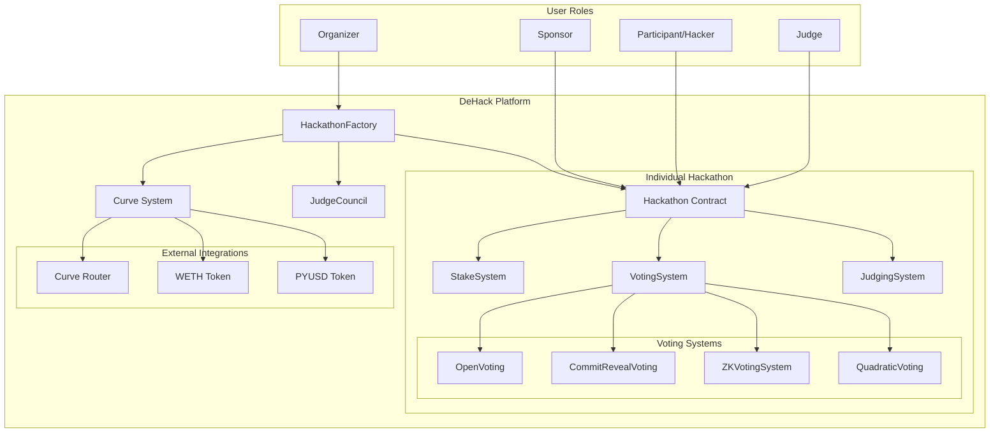
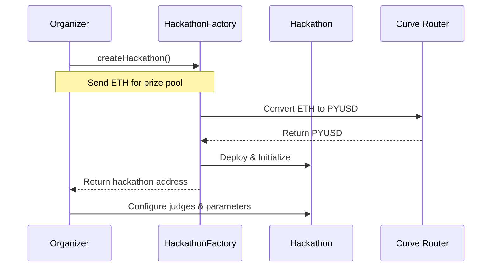
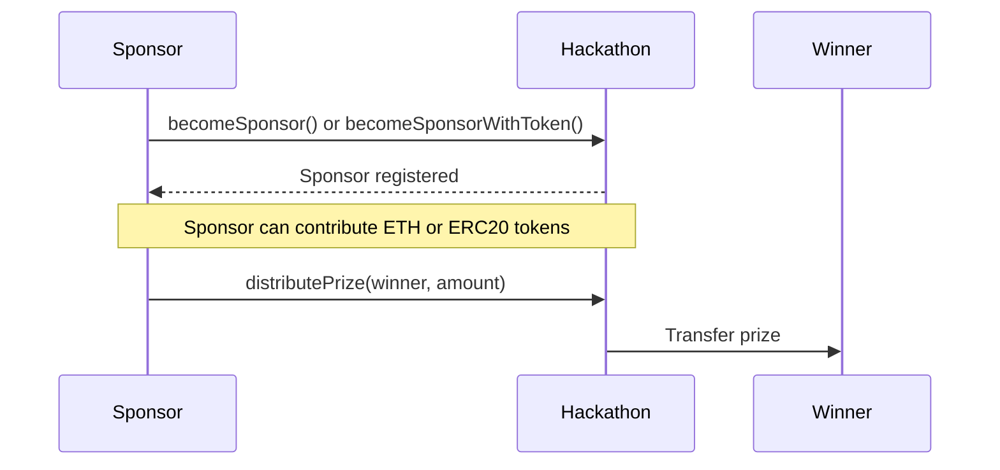
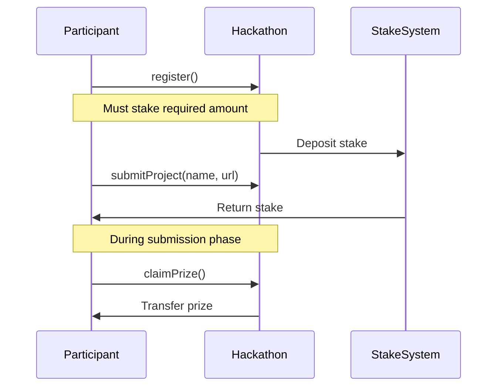
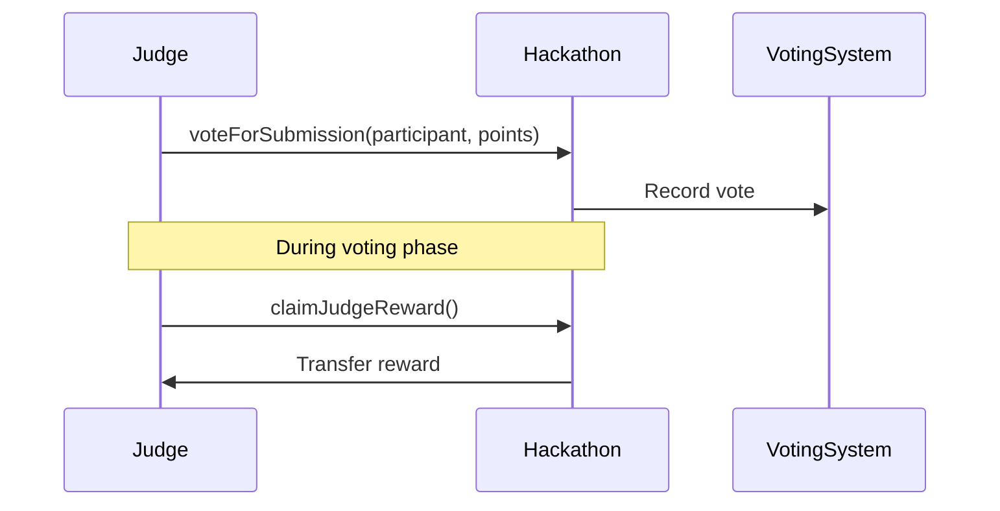
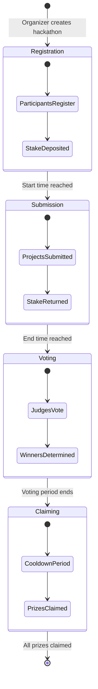
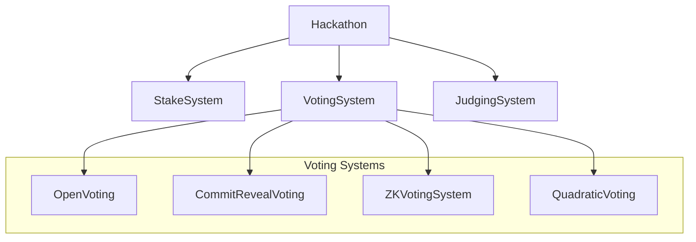

# DeHack Platform - Decentralized Hackathon System

## Overview

DeHack is a comprehensive decentralized hackathon platform built on Ethereum that enables organizers to create hackathons, participants to register and submit projects, judges to evaluate submissions, and winners to claim prizes. The platform uses a factory pattern with cloning for gas-efficient hackathon creation and implements multiple voting systems for fair judging.

## Mainnet Deployment

The DeHack platform is now live on Ethereum Mainnet! The platform has been successfully deployed and is actively being used for hackathon creation and management.

### Deployed Contracts

#### HackathonFactory
**Address**: [`0x9825a0d5cd39a76bf0ab5d47c84b2f3ebd3c40d4`](https://etherscan.io/address/0x9825a0d5cd39a76bf0ab5d47c84b2f3ebd3c40d4)

The main factory contract that creates new hackathon instances. This contract handles:
- Hackathon creation with ETH to PYUSD conversion via Curve Finance
- Global judge governance and validation
- Voting system deployment and configuration

#### Live Hackathons

**Hackathon A (No Sponsor)**
- **Address**: [`0x8034154DeD30a8E2560d8807BE4a78bb89fb5993`](https://etherscan.io/address/0x8034154DeD30a8E2560d8807BE4a78bb89fb5993)
- **Creation Transaction**: [`0x916e32d32b8ba2e827d9e7f2047de6d5b8af909a8f9afad618023a3c4400861c`](https://etherscan.io/tx/0x916e32d32b8ba2e827d9e7f2047de6d5b8af909a8f9afad618023a3c4400861c)
- **Prize Pool**: 20.09 PYUSD (converted from 0.005 ETH)
- **Voting System**: Open Voting with Quadratic Voting enabled
- **Status**: Active hackathon ready for participants

**Hackathon B (With Sponsor)**
- **Address**: [`0x437eA11B3B1a06Ed7EA04b8271365D355053Ba06`](https://etherscan.io/address/0x437eA11B3B1a06Ed7EA04b8271365D355053Ba06)
- **Features**: Includes sponsor contributions and additional prize pools
- **Status**: Active hackathon with enhanced prize structure

### Transaction Analysis

The hackathon creation transaction ([`0x916e32d32b8ba2e827d9e7f2047de6d5b8af909a8f9afad618023a3c4400861c`](https://etherscan.io/tx/0x916e32d32b8ba2e827d9e7f2047de6d5b8af909a8f9afad618023a3c4400861c)) demonstrates the platform's key features:

1. **ETH to PYUSD Conversion**: 0.005 ETH was automatically converted to 20.09 PYUSD via Curve Finance
2. **Voting System Deployment**: Open voting system with quadratic voting enabled
3. **Judge Addition**: Global judge was added to the system
4. **Hackathon Initialization**: Complete hackathon setup with prize distribution

### How to Interact with Live Contracts

#### Using the Factory
```typescript
// Factory contract address
const factoryAddress = "0x9825a0d5cd39a76bf0ab5d47c84b2f3ebd3c40d4";

// Create a new hackathon
const tx = await hackathonFactory.createHackathon(
    hackathonId,
    startTime,
    endTime,
    minimumSponsorContribution,
    stakeAmount,
    prizeDistribution,
    selectedJudges,
    votingConfig,
    { value: prizePoolInETH }
);
```

#### Interacting with Live Hackathons
```typescript
// Hackathon A (No Sponsor)
const hackathonA = "0x8034154DeD30a8E2560d8807BE4a78bb89fb5993";

// Register as participant
await hackathon.register({ value: stakeAmount });

// Submit project
await hackathon.submitProject("Project Name", "https://github.com/user/project");

// Become sponsor
await hackathon.becomeSponsor({ value: sponsorContribution });
```

### Network Information
- **Network**: Ethereum Mainnet
- **Chain ID**: 1
- **PYUSD Token**: [`0x6c3ea9036406852006290770bedfcaba0e23a0e8`](https://etherscan.io/token/0x6c3ea9036406852006290770bedfcaba0e23a0e8)
- **Curve Router**: Used for ETH to PYUSD conversion
- **Gas Optimization**: Clone pattern reduces deployment costs

## System Architecture

### Core Components

The DeHack platform consists of several key smart contracts working together:

1. **HackathonFactory** - Factory contract for creating new hackathons
2. **Hackathon** - Individual hackathon contract managing the lifecycle
3. **Voting Systems** - Multiple voting mechanisms (Open, Commit-Reveal, ZK-SNARK, Quadratic)
4. **Stake System** - Participant stake management
5. **Judge Council** - Global judge governance
6. **Curve Integration** - ETH to PYUSD conversion for prizes

### System Architecture Diagram



## User Roles and Interactions

### 1. Organizer Role

**Responsibilities:**
- Create hackathons using the factory
- Set hackathon parameters (timing, prizes, judges)
- Configure voting systems
- Manage hackathon lifecycle

**Key Interactions:**


**Organizer Flow:**
1. **Hackathon Creation**: Call `createHackathon()` with parameters
2. **Prize Pool Setup**: ETH is automatically converted to PYUSD via Curve
3. **Judge Selection**: Choose judges from global registry
4. **Voting Configuration**: Select voting system type
5. **Hackathon Management**: Monitor and manage hackathon lifecycle

### 2. Sponsor Role

**Responsibilities:**
- Contribute to hackathon prize pools
- Support specific hackathons with ETH or tokens
- Distribute prizes to winners

**Key Interactions:**


**Sponsor Flow:**
1. **Contribution**: Send ETH or ERC20 tokens to become sponsor
2. **Prize Pool**: Sponsor's contribution creates separate prize pool
3. **Distribution**: Sponsor can distribute prizes to winners
4. **Tracking**: Monitor distributed vs. available amounts

### 3. Participant/Hacker Role

**Responsibilities:**
- Register for hackathons
- Submit projects during submission phase
- Claim prizes if winning

**Key Interactions:**


**Participant Flow:**
1. **Registration**: Pay stake to register for hackathon
2. **Development**: Work on project during hackathon period
3. **Submission**: Submit project details before deadline
4. **Stake Return**: Receive stake back upon submission
5. **Prize Claiming**: Claim prizes if winning (after cooldown)

### 4. Judge Role

**Responsibilities:**
- Evaluate submissions during voting phase
- Vote on projects using selected voting system
- Receive judge rewards

**Key Interactions:**


**Judge Flow:**
1. **Voting Phase**: Judge submissions during designated period
2. **Point Allocation**: Allocate points to participants
3. **Voting System**: Use configured voting mechanism
4. **Reward Claiming**: Claim judge rewards after hackathon

## Voting Systems

The platform supports multiple voting mechanisms:

### 1. Open Voting
- Transparent voting system
- All votes are publicly visible
- Simple point allocation

### 2. Commit-Reveal Voting
- Hidden voting until reveal phase
- Prevents strategic voting
- Two-phase process: commit then reveal

### 3. Zero-Knowledge (ZK-SNARK) Voting
- Private voting with cryptographic proofs
- Maintains anonymity while ensuring validity
- Advanced cryptographic implementation

### 4. Quadratic Voting
- Participants get voting credits
- Cost increases quadratically with votes
- Prevents vote buying and promotes fair distribution

## Hackathon Lifecycle



## Technical Features

### Gas Optimization
- **Clone Pattern**: Uses OpenZeppelin's cloning for gas-efficient hackathon creation
- **Batch Operations**: Supports batch voting and operations
- **Efficient Storage**: Optimized data structures for scalability

### Security Features
- **Stake System**: Participants must stake to prevent spam
- **Judge Validation**: Global judge registry with validation
- **Time-based Phases**: Automatic phase progression
- **Access Controls**: Role-based permissions

### Integration Features
- **Curve Finance**: Automatic ETH to PYUSD conversion
- **Multi-token Support**: Support for ETH and ERC20 tokens
- **Flexible Voting**: Multiple voting system options
- **Sponsor System**: Independent sponsor prize pools

## Smart Contract Architecture

### Core Contracts

#### HackathonFactory.sol
```solidity
contract HackathonFactory is JudgeCouncil {
    function createHackathon(
        uint256 _hackathonId,
        uint256 _startTime,
        uint256 _endTime,
        uint256 _minimumSponsorContribution,
        uint256 _stakeAmount,
        uint256[] memory _prizeDistribution,
        address[] memory _selectedJudges,
        VotingConfig memory _votingConfig
    ) external payable returns (address hackathonAddress)
}
```

#### Hackathon.sol
```solidity
contract Hackathon is StakeSystem, VotingSystem, JudgingSystem {
    // Manages entire hackathon lifecycle
    // Inherits stake, voting, and judging functionality
}
```

### Inheritance Hierarchy



## Getting Started

### Prerequisites
- Node.js and Bun
- Ethereum development environment
- Understanding of smart contracts

### Installation
```bash
# Install dependencies
bun install

# Compile contracts
bun run compile

# Run tests
bun run test
```

### Deployment
```bash
# Deploy to local network
bun run deploy:local

# Deploy to testnet
bun run deploy:testnet

# Deploy to mainnet
bun run deploy:mainnet
```

## Usage Examples

### Creating a Hackathon
```typescript
const hackathonParams = {
    hackathonId: 1,
    startTime: Math.floor(Date.now() / 1000) + 3600, // 1 hour from now
    endTime: Math.floor(Date.now() / 1000) + 86400,   // 24 hours from now
    minimumSponsorContribution: parseEther("0.1"),
    stakeAmount: parseEther("0.01"),
    prizeDistribution: [parseEther("1"), parseEther("0.5"), parseEther("0.3")],
    selectedJudges: [judge1, judge2, judge3],
    votingConfig: {
        systemType: 0, // Open voting
        useQuadraticVoting: false,
        votingPowerPerJudge: 100,
        maxWinners: 3
    }
};

const tx = await hackathonFactory.createHackathon(
    ...Object.values(hackathonParams),
    { value: parseEther("2") } // Prize pool
);
```

### Participating in a Hackathon
```typescript
// Register for hackathon
await hackathon.register({ value: stakeAmount });

// Submit project
await hackathon.submitProject(
    "My Awesome Project",
    "https://github.com/user/project"
);

// Claim prize (if winning)
await hackathon.claimPrize();
```

### Sponsoring a Hackathon
```typescript
// Become sponsor with ETH
await hackathon.becomeSponsor({ value: parseEther("0.5") });

// Become sponsor with ERC20 token
await token.approve(hackathon.address, parseEther("100"));
await hackathon.becomeSponsorWithToken(token.address, parseEther("100"));

// Distribute prize
await hackathon.distributePrize(winnerAddress, parseEther("0.1"));
```

## Security Considerations

### Audit Recommendations
- All contracts should undergo professional security audits
- Test all voting systems thoroughly
- Validate judge selection mechanisms
- Review stake and prize distribution logic

### Best Practices
- Use multi-signature wallets for factory operations
- Implement proper access controls
- Regular security updates
- Monitor for unusual activity

## Contributing

We welcome contributions to the DeHack platform! Please see our contributing guidelines for more information.

### Development Setup
1. Fork the repository
2. Create a feature branch
3. Make your changes
4. Add tests for new functionality
5. Submit a pull request

## License

This project is licensed under the MIT License - see the LICENSE file for details.

## Support

For support and questions:
- Create an issue on GitHub
- Join our Discord community
- Check the documentation wiki

---

**DeHack Platform** - Building the future of decentralized hackathons on Ethereum.