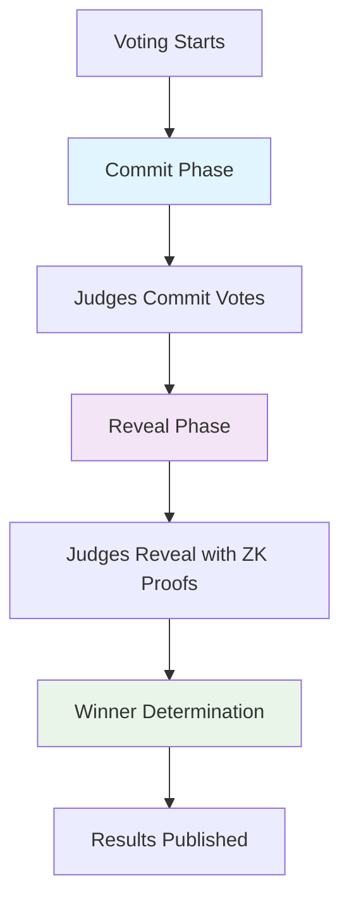

# DeHack ZK Voting System

A Zero-Knowledge voting system for the DeHack platform that enables judges to vote privately while maintaining verifiability and transparency.

## 🔐 Privacy Features

- **Private Voting**: Judges can vote without revealing their choices until the reveal phase
- **ZK Proofs**: Cryptographic proofs ensure vote validity without revealing vote details
- **Commit-Reveal Scheme**: Two-phase voting prevents vote buying and coercion
- **Verifiable Results**: Winners can be determined and verified without exposing individual votes

## 🏗️ Architecture

### Smart Contract (`ZKVotingSystem.sol`)
- Manages voting phases (commit and reveal)
- Stores vote commitments and reveals
- Verifies ZK proofs
- Determines winners based on aggregated scores

### ZK Circuit (`vote_verification.circom`)
- Proves vote validity without revealing details
- Ensures points are within valid range (0-100)
- Verifies commitment matches reveal
- Uses Poseidon hash for efficiency

### Client Library (`index.ts`)
- Generates vote commitments
- Creates ZK proofs
- Interacts with smart contract
- Provides utility functions

## 🚀 How It Works

### 1. Commit Phase (2 days)
```typescript
// Judge creates a vote commitment
const voteData = {
  judge: judgeAddress,
  participant: participantAddress,
  points: 85,
  nonce: generateNonce()
};

const commitment = await client.generateVoteCommitment(voteData);
await client.commitVote(judgeWallet, commitment.commitment);
```

### 2. Reveal Phase (1 day)
```typescript
// Judge reveals vote with ZK proof
const zkProof = await client.generateZKProof(voteData);
await client.revealVote(judgeWallet, voteData, zkProof);
```

### 3. Winner Determination
```typescript
// After reveal phase, winners are determined
const winners = await client.getWinners();
const participantScore = await client.getParticipantScore(participantAddress);
```

## 🔒 Security Guarantees

### Privacy
- **Individual votes remain private** until reveal phase
- **ZK proofs** ensure validity without revealing details
- **Commitments** prevent vote buying and coercion

### Verifiability
- **All votes are verifiable** through ZK proofs
- **Commitments can be verified** against reveals
- **Winner determination is transparent** and auditable

### Integrity
- **Points are validated** to be within 0-100 range
- **Commitments must match** reveals
- **Only registered judges** can vote

## 📊 Voting Flow



## 🛠️ Installation

```bash
# Install dependencies
npm install

# Build the project
npm run build

# Run tests
npm test
```

## 📝 Usage

### Basic Voting
```typescript
import { ZKVotingClient, ZKVotingUtils } from './src/index';

// Initialize client
const client = new ZKVotingClient(contractAddress, provider, abi);

// Create vote data
const voteData = {
  judge: judgeAddress,
  participant: participantAddress,
  points: 85,
  nonce: ZKVotingUtils.generateNonce()
};

// Commit vote
const commitment = await client.generateVoteCommitment(voteData);
await client.commitVote(judgeWallet, commitment.commitment);

// Reveal vote
const zkProof = await client.generateZKProof(voteData);
await client.revealVote(judgeWallet, voteData, zkProof);
```

### Advanced Features
```typescript
// Get voting statistics
const stats = await client.getVotingStats();
console.log(`Committed: ${stats.committed}, Revealed: ${stats.revealed}`);

// Check participant scores
const score = await client.getParticipantScore(participantAddress);
console.log(`Points: ${score.totalPoints}, Votes: ${score.voteCount}`);

// Get winners
const winners = await client.getWinners();
console.log('Winners:', winners);
```

## 🔧 Development

### Circuit Compilation
```bash
# Compile Circom circuit
circom circuits/vote_verification.circom --r1cs --wasm --sym

# Generate trusted setup
snarkjs powersoftau new bn128 12 pot12_0000.ptau -v
snarkjs powersoftau contribute pot12_0000.ptau pot12_0001.ptau --name="First contribution" -v
snarkjs powersoftau prepare phase2 pot12_0001.ptau pot12_final.ptau -v

# Generate proving key
snarkjs groth16 setup vote_verification.r1cs pot12_final.ptau vote_verification_0000.zkey
snarkjs zkey contribute vote_verification_0000.zkey vote_verification_0001.zkey --name="1st Contributor" -v
snarkjs zkey export verificationkey vote_verification_0001.zkey verification_key.json
```

### Testing
```bash
# Run unit tests
npm test

# Run integration tests
npm run test:integration

# Run with coverage
npm run test:coverage
```

## 🎯 Benefits

### For Judges
- **Privacy**: Vote without pressure or influence
- **Security**: Votes are cryptographically protected
- **Flexibility**: Can change votes during commit phase

### For Participants
- **Fairness**: No vote buying or coercion possible
- **Transparency**: Results are verifiable and auditable
- **Trust**: System is mathematically provable

### For Organizers
- **Integrity**: Voting process is tamper-proof
- **Efficiency**: Automated winner determination
- **Compliance**: Meets highest security standards

## 🔮 Future Enhancements

- **Multi-round voting**: Support for elimination rounds
- **Weighted voting**: Different judge weights
- **Anonymous judges**: Complete anonymity for judges
- **Cross-chain support**: Multi-chain voting
- **Mobile SDK**: Native mobile applications

## 📚 Technical Details

### ZK Proof System
- **Circuit**: Circom-based vote verification
- **Hash Function**: Poseidon for efficiency
- **Proof System**: Groth16 for compact proofs
- **Trusted Setup**: Ceremony-based setup

### Smart Contract
- **Language**: Solidity 0.8.28
- **Framework**: OpenZeppelin
- **Gas Optimization**: Efficient storage and computation
- **Security**: ReentrancyGuard, access controls

### Client Library
- **Language**: TypeScript
- **Dependencies**: ethers.js, snarkjs, circomlib
- **Features**: Type safety, error handling, utilities

## 🤝 Contributing

1. Fork the repository
2. Create a feature branch
3. Make your changes
4. Add tests for new functionality
5. Ensure all tests pass
6. Submit a pull request

## 📄 License

This project is licensed under the MIT License - see the LICENSE file for details.

## 🆘 Support

For questions or support, please open an issue on the GitHub repository or contact the development team.

---

*Last updated: October 17, 2025*  
*Version: 1.0.0*
